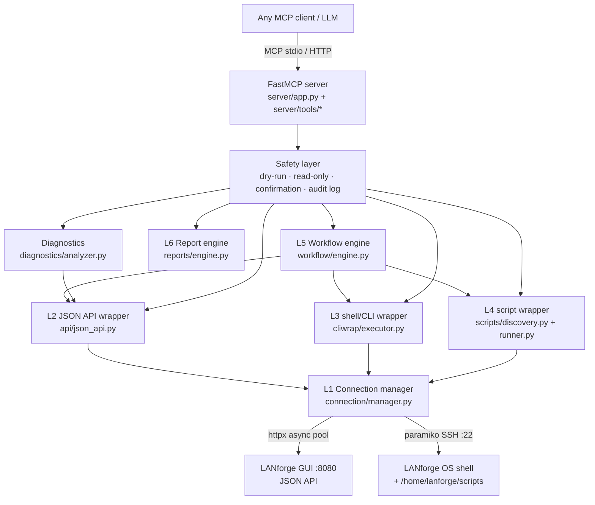

# LANforge MCP Server — Architecture

`lanforge-mcp` exposes the complete power of a Candela Technologies LANforge traffic
generator to any MCP-compatible AI model. It is model-agnostic: every capability is an
MCP tool with a JSON schema, so Claude, GPT, Gemini, Cursor, Cline, Continue.dev,
OpenHands, Ollama-hosted models, or any other MCP client can operate LANforge.

## Design philosophy: hybrid tool surface

LANforge has **600+ CLI commands**, **55+ JSON GET endpoints**, and **115+ automation
scripts**. Exposing each one as an individual MCP tool would produce a catalog no LLM
can select from reliably, and would break every time LANforge is upgraded.

Instead the server exposes **~35 curated, AI-friendly tools** in two categories:

1. **High-level operator tools** — the things an operator does every day, with
   ergonomic parameters and validated schemas: `create_stations`, `create_l3_traffic`,
   `start_traffic`, `station_status`, `monitor`, `run_workflow`, `generate_report`, …

2. **Dynamic gateway tools** — four discovery tools and three invocation tools that
   make *everything else* reachable without a dedicated tool:

   | Discovery                    | Invocation                          |
   |------------------------------|-------------------------------------|
   | `list_commands` (600+ CLI)   | `run_command` → `POST /cli-json/*`  |
   | `command_help`               | `raw_cli` → `POST /cli-json/raw`    |
   | `list_endpoints` (55+ GET)   | `query` → `GET /<endpoint>`         |
   | `list_scripts` + `script_schema` | `run_script` → any py-script    |

   When LANforge is upgraded, new commands/endpoints/scripts appear in the discovery
   tools automatically — no code change to this server.

## Layer diagram



## Layer 1 — Connection manager (`connection/`)

* **Multi-system registry.** Every tool takes an optional `system_id`; with one system
  configured it is implied. Systems come from `config.yaml`, environment variables, or
  the `connect` tool at runtime.
* **HTTP/HTTPS** via a pooled `httpx.AsyncClient` per system (keep-alive, HTTP/2 off —
  the LANforge GUI is HTTP/1.1). Automatic `POST /newsession` to acquire the
  `X-LFJson-ID` session header, transparent re-acquisition on session loss, retry with
  exponential backoff on transient errors, configurable timeouts.
* **SSH** via paramiko wrapped in `anyio.to_thread` so the async server never blocks.
  Default credentials `lanforge`/`lanforge`, key auth supported, auto-reconnect,
  per-command timeout.

## Layer 2 — JSON API wrapper (`api/`)

The LANforge GUI (port 8080) is a complete self-describing REST façade over the CLI:

* `GET /<table>` — 55+ endpoints (`/port`, `/stations`, `/cx`, `/endp`, `/events`,
  `/alerts`, `/radiostatus`, `/wifi-stats`, …) with `?fields=` column selection.
* `POST /cli-json/<command>` — every one of the 600+ CLI commands as JSON.
* `POST /cli-json/raw` — a raw one-line CLI command.
* `GET /help/<command>` — live per-command documentation.

`api/json_api.py` wraps all of this with typed responses, LANforge quirk handling
(single-row vs list responses, `interest`/flag fields), retry, and structured
`LANforgeError` translation.

**Catalogs.** `data/commands.json` and `data/endpoints.json` are *generated* from the
official `lanforge_client/lanforge_api.py` by `tools/generate_catalog.py` (AST-based —
never hand-written). They power offline discovery/validation and are advisory only:
unknown commands are still forwarded to `/cli-json/<cmd>`, so a newer LANforge works
without regenerating. At runtime the live `/help` is consulted when available.

## Layer 3 — Shell/CLI wrapper (`cliwrap/`)

`shell_command` executes anything on the LANforge box over SSH and returns
`{stdout, stderr, exit_code, duration_ms}` as structured JSON. This covers native
binaries (`iw`, `ethtool`, `tcpdump`, chamber serial consoles, …) and the classic
Perl scripts. Guarded by the safety layer (read-only mode blocks it; audit-logged).

## Layer 4 — lanforge-scripts wrapper (`scripts/`)

* **Discovery** scans a configured `scripts_path` (a local clone of
  `greearb/lanforge-scripts`, or the standard `/home/lanforge/scripts` on the box via
  SSH) for `py-scripts/*.py`.
* **Schema extraction** parses each script's `argparse` definitions with Python's
  `ast` module — argument names, types, defaults, choices, required flags, help text —
  and emits a JSON Schema per script. New scripts appear automatically.
* **Execution** runs scripts locally (subprocess) or remotely (SSH), injecting `--mgr`
  automatically, with streaming output capture, timeout, background runs with
  `script_status`/`script_output`/`stop_script`, and cancellation.

## Layer 5 — Workflow engine (`workflow/`)

Declarative step chaining so one tool call can run an entire test campaign:

```yaml
steps:
  - {action: command, command: add_sta, params: {...}, register: sta}
  - {action: wait_for, endpoint: port, until: "ip != 0.0.0.0", timeout: 120}
  - {action: command, command: add_endp, params: {...}}
  - {action: command, command: set_cx_state, params: {cx_state: RUNNING, ...}}
  - {action: sample, endpoint: cx, interval: 5, duration: 60, register: stats}
  - {action: report, title: "L3 test", data: "${stats}"}
  - {action: command, command: rm_cx, params: {...}, on_error: continue}
```

Features: `${variable}` substitution, per-step `register` output capture, `wait` /
`wait_for` condition polling, `sample` periodic stat collection, per-step error policy
(`abort` | `continue` | `retry:N`), dry-run of the whole plan, progress reporting, and
cancellation. Built-in templates cover the common campaigns (station bring-up + L3
throughput, L4/HTTP, station-connect smoke test, cleanup).

## Layer 6 — Report engine (`reports/`)

Consumes samples/tables/logs collected by workflows or monitor tools and produces
**Markdown**, **standalone HTML**, and **JSON** (PDF-ready via the HTML). Every report
includes an *AI summary block* — computed min/avg/max, deltas, anomaly flags — so the
LLM can reason about results without re-parsing raw tables.

## Diagnostics (`diagnostics/`)

Read-only analyzers that answer operator questions directly:
`health_check` (GUI reachable, resources up, phantom ports), `diagnose stations`
(no-IP, low-RSSI, phantom, disassociated with per-station reasons), `diagnose traffic`
(zero-throughput cx, drops, latency), `analyze events` (disconnect/roam failure
patterns from `/events`), plus throughput comparison between two samples.

## Safety layer (`safety.py`)

* **Read-only mode** — blocks every mutating call (`/cli-json/*`, shell, scripts).
* **Dry-run mode** — mutating calls return the exact request that *would* be sent.
* **Destructive-command confirmation** — commands matching the destructive catalog
  (`rm_*`, `reset_*`, `reboot`, `shutdown`, …) require `confirm=true` in the call.
* **Audit log** — every mutating operation is appended to a JSONL audit file with
  timestamp, system, operation, parameters, and outcome.

## Configuration & deployment

Precedence: **CLI args > environment (`LANFORGE_MCP_*`) > config.yaml > defaults**.
Transports: stdio (default) and streamable HTTP for remote deployment. Ships with
Dockerfile, docker-compose.yml, GitHub Actions CI (ruff + mypy + pytest), and a mock
LANforge (in-process ASGI app emulating the JSON API) used by the integration tests.

## Source layout

```
lanforge-mcp/
├── src/lanforge_mcp/
│   ├── config.py  errors.py  models.py  safety.py  logging_setup.py  cli.py
│   ├── connection/   manager.py  http_client.py  ssh_client.py
│   ├── api/          json_api.py  catalog.py
│   ├── cliwrap/      executor.py
│   ├── scripts/      discovery.py  runner.py
│   ├── workflow/     engine.py  templates.py
│   ├── reports/      engine.py
│   ├── diagnostics/  analyzer.py
│   ├── server/       app.py  tools/ (one module per tool group)
│   └── data/         commands.json  endpoints.json  (generated)
├── tools/generate_catalog.py
├── tests/            mock_lanforge.py + unit & integration tests
├── docs/             architecture, tools, user/dev guides, security, troubleshooting
├── examples/         config.yaml, workflows, AI conversation transcripts
└── Dockerfile  docker-compose.yml  pyproject.toml  .github/workflows/ci.yml
```
